# ArcNet — Architecture & Design Documentation

> Derived from the [README.md](./README.md) specification of the ArcNet platform — **The India-First AVGC Ecosystem** by Arcavon.

---

## Table of Contents

1. [Entity-Relationship (ER) Diagram](#1-entity-relationship-er-diagram)
2. [UML Class Diagram](#2-uml-class-diagram)
3. [Use Case Diagram](#3-use-case-diagram)

---

## 1. Entity-Relationship (ER) Diagram

This diagram models the core data entities and their relationships as they would be stored in MongoDB (via Mongoose schemas). Relationships are expressed using crow's foot notation.

```mermaid
erDiagram

    USER {
        ObjectId _id PK
        String username UK
        String email UK
        String passwordHash
        String googleId
        String displayName
        String avatarUrl
        String bio
        String[] skills
        String role "developer | artist | animator | storywriter | tester"
        Boolean isMentor
        DateTime createdAt
        DateTime updatedAt
    }

    POST {
        ObjectId _id PK
        ObjectId authorId FK
        String content
        String[] mediaUrls
        String mediaType "image | video | model3d"
        String hubCategory "game_dev | 2d3d_art | animation | storywriting | testing"
        Int likesCount
        Int commentsCount
        DateTime createdAt
    }

    COMMENT {
        ObjectId _id PK
        ObjectId postId FK
        ObjectId authorId FK
        String body
        DateTime createdAt
    }

    FOLLOW {
        ObjectId _id PK
        ObjectId followerId FK
        ObjectId followingId FK
        DateTime createdAt
    }

    NOTIFICATION {
        ObjectId _id PK
        ObjectId recipientId FK
        ObjectId senderId FK
        String type "follow | message | team_invite | jam_update | job_alert"
        String message
        Boolean isRead
        DateTime createdAt
    }

    DIRECT_MESSAGE {
        ObjectId _id PK
        ObjectId senderId FK
        ObjectId receiverId FK
        String content
        Boolean isRead
        DateTime createdAt
    }

    PUBLIC_HUB {
        ObjectId _id PK
        String name UK
        String category "game_dev | 2d3d_art | animation | storywriting | testing"
        String description
        Int memberCount
        DateTime createdAt
    }

    PRIVATE_HUB {
        ObjectId _id PK
        ObjectId ownerId FK
        String name
        String hubCode UK
        String description
        Boolean isActive
        DateTime createdAt
    }

    PRIVATE_HUB_MEMBER {
        ObjectId _id PK
        ObjectId hubId FK
        ObjectId userId FK
        String role "owner | admin | member"
        String status "pending | approved | rejected"
        DateTime joinedAt
    }

    TEAM {
        ObjectId _id PK
        String name UK
        String description
        String logoUrl
        ObjectId createdBy FK
        Int memberCount
        DateTime createdAt
    }

    TEAM_MEMBER {
        ObjectId _id PK
        ObjectId teamId FK
        ObjectId userId FK
        String role "leader | member"
        String status "pending | approved | rejected"
        DateTime joinedAt
    }

    GAME_JAM {
        ObjectId _id PK
        String title
        String description
        String bannerUrl
        String type "flagship | community"
        Decimal prizePool
        String currency "INR"
        DateTime startDate
        DateTime endDate
        String status "upcoming | active | completed"
        DateTime createdAt
    }

    GAME_JAM_PARTICIPANT {
        ObjectId _id PK
        ObjectId jamId FK
        ObjectId userId FK
        ObjectId teamId FK
        String submissionUrl
        DateTime registeredAt
    }

    MENTOR_PROFILE {
        ObjectId _id PK
        ObjectId userId FK
        String specialization "game_designer | animator | vfx_artist | other"
        String[] expertise
        Boolean isVerified
        Decimal sessionRate
        String currency "INR"
        String availability
        Float rating
        Int totalSessions
        DateTime createdAt
    }

    MENTORSHIP_SESSION {
        ObjectId _id PK
        ObjectId mentorProfileId FK
        ObjectId menteeId FK
        DateTime scheduledAt
        Int durationMinutes
        String status "booked | completed | cancelled"
        String meetingLink
        DateTime createdAt
    }

    JOB_LISTING {
        ObjectId _id PK
        ObjectId postedBy FK
        String title
        String company
        String description
        String type "internship | full_time | contract | freelance"
        String location
        Boolean isRemote
        Decimal compensationMin
        Decimal compensationMax
        String compensationPeriod "yearly | monthly"
        String currency "INR"
        String[] requiredSkills
        String status "active | closed"
        DateTime postedAt
        DateTime deadline
    }

    JOB_APPLICATION {
        ObjectId _id PK
        ObjectId jobId FK
        ObjectId applicantId FK
        String resumeUrl
        String coverLetter
        String status "applied | reviewed | shortlisted | rejected | hired"
        DateTime appliedAt
    }

    %% ── Relationships ──

    USER ||--o{ POST : "creates"
    USER ||--o{ COMMENT : "writes"
    POST ||--o{ COMMENT : "has"
    USER ||--o{ FOLLOW : "follows"
    USER ||--o{ FOLLOW : "is followed by"
    USER ||--o{ NOTIFICATION : "receives"
    USER ||--o{ DIRECT_MESSAGE : "sends"
    USER ||--o{ DIRECT_MESSAGE : "receives"

    PUBLIC_HUB ||--o{ POST : "contains"

    USER ||--o{ PRIVATE_HUB : "owns"
    PRIVATE_HUB ||--o{ PRIVATE_HUB_MEMBER : "has"
    USER ||--o{ PRIVATE_HUB_MEMBER : "joins"

    USER ||--o{ TEAM : "creates"
    TEAM ||--o{ TEAM_MEMBER : "has"
    USER ||--o{ TEAM_MEMBER : "joins"

    GAME_JAM ||--o{ GAME_JAM_PARTICIPANT : "has"
    USER ||--o{ GAME_JAM_PARTICIPANT : "participates in"
    TEAM ||--o{ GAME_JAM_PARTICIPANT : "competes in"

    USER ||--o| MENTOR_PROFILE : "has"
    MENTOR_PROFILE ||--o{ MENTORSHIP_SESSION : "hosts"
    USER ||--o{ MENTORSHIP_SESSION : "books as mentee"

    USER ||--o{ JOB_LISTING : "posts"
    JOB_LISTING ||--o{ JOB_APPLICATION : "receives"
    USER ||--o{ JOB_APPLICATION : "submits"
```

### Entity Summary

| Entity | Purpose |
|---|---|
| **User** | Central entity — every actor on the platform |
| **Post / Comment** | Social feed content within Public Hubs |
| **Follow / DirectMessage / Notification** | Social connectivity & real-time engagement |
| **PublicHub** | Categorized community feeds (Game Dev, Artists, etc.) |
| **PrivateHub / PrivateHubMember** | Code-gated collaboration spaces for studios |
| **Team / TeamMember** | Squad formation with join requests |
| **GameJam / GameJamParticipant** | Competition portal with registration & submissions |
| **MentorProfile / MentorshipSession** | Verified professional mentorship booking |
| **JobListing / JobApplication** | India-first hiring hub with INR compensation |

---

## 2. UML Class Diagram

This diagram models the backend domain classes (Mongoose models), their attributes, methods, and inter-class relationships as they would be implemented in the TypeScript backend.

```mermaid
classDiagram
    direction TB

    class User {
        -ObjectId _id
        -String username
        -String email
        -String passwordHash
        -String googleId
        -String displayName
        -String avatarUrl
        -String bio
        -String[] skills
        -Role role
        -Boolean isMentor
        -DateTime createdAt
        -DateTime updatedAt
        +register(email, password) User
        +loginWithCredentials(email, password) AuthToken
        +loginWithGoogle(googleId) AuthToken
        +updateProfile(data) User
        +followUser(targetUserId) void
        +unfollowUser(targetUserId) void
        +getFollowers() User[]
        +getFollowing() User[]
        +searchBySkill(skill) User[]
    }

    class AuthService {
        +generateJWT(userId) String
        +verifyJWT(token) TokenPayload
        +hashPassword(password) String
        +comparePassword(plain, hash) Boolean
        +handleGoogleOAuth(code) User
        +refreshToken(token) String
    }

    class Post {
        -ObjectId _id
        -ObjectId authorId
        -String content
        -String[] mediaUrls
        -MediaType mediaType
        -HubCategory hubCategory
        -Int likesCount
        -Int commentsCount
        -DateTime createdAt
        +create(authorId, data) Post
        +delete(postId) void
        +like(userId) void
        +unlike(userId) void
        +getByHub(category) Post[]
        +getFeed(userId) Post[]
    }

    class Comment {
        -ObjectId _id
        -ObjectId postId
        -ObjectId authorId
        -String body
        -DateTime createdAt
        +create(postId, authorId, body) Comment
        +delete(commentId) void
        +getByPost(postId) Comment[]
    }

    class PublicHub {
        -ObjectId _id
        -String name
        -HubCategory category
        -String description
        -Int memberCount
        +getPosts(page, limit) Post[]
        +getMembers() User[]
    }

    class PrivateHub {
        -ObjectId _id
        -ObjectId ownerId
        -String name
        -String hubCode
        -String description
        -Boolean isActive
        -DateTime createdAt
        +create(ownerId, name, hubCode) PrivateHub
        +submitEntryRequest(userId, hubCode) PrivateHubMember
        +approveRequest(memberId) void
        +rejectRequest(memberId) void
        +getMembers() User[]
    }

    class PrivateHubMember {
        -ObjectId _id
        -ObjectId hubId
        -ObjectId userId
        -MemberRole role
        -RequestStatus status
        -DateTime joinedAt
    }

    class Team {
        -ObjectId _id
        -String name
        -String description
        -String logoUrl
        -ObjectId createdBy
        -Int memberCount
        -DateTime createdAt
        +create(leaderId, data) Team
        +requestToJoin(userId) TeamMember
        +approveJoinRequest(memberId) void
        +rejectJoinRequest(memberId) void
        +removeMember(memberId) void
        +getMembers() User[]
        +browse(page, limit) Team[]
    }

    class TeamMember {
        -ObjectId _id
        -ObjectId teamId
        -ObjectId userId
        -TeamRole role
        -RequestStatus status
        -DateTime joinedAt
    }

    class GameJam {
        -ObjectId _id
        -String title
        -String description
        -String bannerUrl
        -JamType type
        -Decimal prizePool
        -String currency
        -DateTime startDate
        -DateTime endDate
        -JamStatus status
        -DateTime createdAt
        +create(data) GameJam
        +register(userId, teamId?) GameJamParticipant
        +submitProject(participantId, url) void
        +getFeatured() GameJam[]
        +getUpcoming() GameJam[]
        +getParticipants(jamId) User[]
    }

    class GameJamParticipant {
        -ObjectId _id
        -ObjectId jamId
        -ObjectId userId
        -ObjectId teamId
        -String submissionUrl
        -DateTime registeredAt
    }

    class MentorProfile {
        -ObjectId _id
        -ObjectId userId
        -String specialization
        -String[] expertise
        -Boolean isVerified
        -Decimal sessionRate
        -String currency
        -String availability
        -Float rating
        -Int totalSessions
        +create(userId, data) MentorProfile
        +update(data) MentorProfile
        +browse(filters) MentorProfile[]
        +getBySpecialization(spec) MentorProfile[]
    }

    class MentorshipSession {
        -ObjectId _id
        -ObjectId mentorProfileId
        -ObjectId menteeId
        -DateTime scheduledAt
        -Int durationMinutes
        -SessionStatus status
        -String meetingLink
        +book(mentorProfileId, menteeId, slot) MentorshipSession
        +cancel(sessionId) void
        +complete(sessionId) void
        +getUpcoming(userId) MentorshipSession[]
    }

    class JobListing {
        -ObjectId _id
        -ObjectId postedBy
        -String title
        -String company
        -String description
        -JobType type
        -String location
        -Boolean isRemote
        -Decimal compensationMin
        -Decimal compensationMax
        -CompPeriod compensationPeriod
        -String currency
        -String[] requiredSkills
        -ListingStatus status
        -DateTime postedAt
        -DateTime deadline
        +create(postedBy, data) JobListing
        +update(jobId, data) JobListing
        +close(jobId) void
        +browse(filters) JobListing[]
        +search(query) JobListing[]
    }

    class JobApplication {
        -ObjectId _id
        -ObjectId jobId
        -ObjectId applicantId
        -String resumeUrl
        -String coverLetter
        -ApplicationStatus status
        -DateTime appliedAt
        +apply(jobId, applicantId, data) JobApplication
        +updateStatus(applicationId, status) void
        +getByJob(jobId) JobApplication[]
        +getByUser(userId) JobApplication[]
    }

    class NotificationService {
        -ObjectId _id
        -ObjectId recipientId
        -ObjectId senderId
        -NotificationType type
        -String message
        -Boolean isRead
        -DateTime createdAt
        +send(recipientId, type, message) Notification
        +markAsRead(notificationId) void
        +getUnread(userId) Notification[]
        +emitRealtime(userId, event) void
    }

    class DirectMessage {
        -ObjectId _id
        -ObjectId senderId
        -ObjectId receiverId
        -String content
        -Boolean isRead
        -DateTime createdAt
        +send(senderId, receiverId, content) DirectMessage
        +getConversation(user1, user2) DirectMessage[]
        +markAsRead(messageId) void
        +getUnreadCount(userId) Int
    }

    class CacheService {
        +get(key) any
        +set(key, value, ttl) void
        +invalidate(key) void
        +invalidatePattern(pattern) void
    }

    class SocketService {
        +initialize(httpServer) void
        +emitToUser(userId, event, data) void
        +emitToRoom(room, event, data) void
        +joinRoom(socketId, room) void
        +leaveRoom(socketId, room) void
    }

    %% ── Relationships ──

    User "1" --> "*" Post : creates
    User "1" --> "*" Comment : writes
    Post "1" --> "*" Comment : has
    User "1" --> "*" DirectMessage : sends/receives
    User "1" --> "*" NotificationService : receives
    User "*" --> "*" User : follows

    PublicHub "1" --> "*" Post : contains

    User "1" --> "*" PrivateHub : owns
    PrivateHub "1" --> "*" PrivateHubMember : has
    User "1" --> "*" PrivateHubMember : joins via

    User "1" --> "*" Team : creates
    Team "1" --> "*" TeamMember : has
    User "1" --> "*" TeamMember : joins via

    GameJam "1" --> "*" GameJamParticipant : has
    User "1" --> "*" GameJamParticipant : participates via
    Team "1" --> "*" GameJamParticipant : competes via

    User "1" --> "0..1" MentorProfile : has
    MentorProfile "1" --> "*" MentorshipSession : hosts
    User "1" --> "*" MentorshipSession : books

    User "1" --> "*" JobListing : posts
    JobListing "1" --> "*" JobApplication : receives
    User "1" --> "*" JobApplication : submits

    AuthService ..> User : authenticates
    CacheService ..> Post : caches
    CacheService ..> JobListing : caches
    SocketService ..> NotificationService : powers
    SocketService ..> DirectMessage : powers
```

### Enumerations Reference

| Enum | Values |
|---|---|
| **Role** | `developer`, `artist`, `animator`, `storywriter`, `tester` |
| **MediaType** | `image`, `video`, `model3d` |
| **HubCategory** | `game_dev`, `2d3d_art`, `animation`, `storywriting`, `testing` |
| **MemberRole** | `owner`, `admin`, `member` |
| **TeamRole** | `leader`, `member` |
| **RequestStatus** | `pending`, `approved`, `rejected` |
| **JamType** | `flagship`, `community` |
| **JamStatus** | `upcoming`, `active`, `completed` |
| **SessionStatus** | `booked`, `completed`, `cancelled` |
| **JobType** | `internship`, `full_time`, `contract`, `freelance` |
| **CompPeriod** | `yearly`, `monthly` |
| **ListingStatus** | `active`, `closed` |
| **ApplicationStatus** | `applied`, `reviewed`, `shortlisted`, `rejected`, `hired` |
| **NotificationType** | `follow`, `message`, `team_invite`, `jam_update`, `job_alert` |

---

## 3. Use Case Diagram

This diagram captures all actor-to-feature interactions across the ArcNet platform, organized by module boundary.

```mermaid
flowchart TB
    subgraph Actors
        GUEST([🧑 Guest])
        USER_ACTOR([🧑‍💻 Registered User])
        MENTOR_ACTOR([🎓 Mentor])
        EMPLOYER([🏢 Employer / Studio])
        ADMIN([🛡️ Admin])
    end

    subgraph AUTH ["🔐 Authentication & Authorization"]
        A1["Register with Email/Password"]
        A2["Login with Email/Password"]
        A3["Login with Google OAuth"]
        A4["Manage Profile & Skills"]
        A5["Logout"]
    end

    subgraph HUBS ["📢 Public Hubs"]
        H1["Browse Hub Categories"]
        H2["View Hub Feed"]
        H3["Create Post (text, image, 3D)"]
        H4["Like / Comment on Post"]
        H5["Search Posts"]
    end

    subgraph SOCIAL ["💬 Social & Connectivity"]
        S1["Follow / Unfollow Users"]
        S2["Send Direct Message"]
        S3["View Notifications"]
        S4["Search Users by Skill"]
        S5["View User Profile"]
    end

    subgraph PRIVATE ["🔒 Private Hubs"]
        PH1["Create Private Hub"]
        PH2["Enter Hub Code & Request Access"]
        PH3["Approve / Reject Entry Requests"]
        PH4["Collaborate in Private Hub"]
    end

    subgraph TEAMS ["👥 Team Formation"]
        T1["Browse Teams"]
        T2["Request to Join Team"]
        T3["Create a Team"]
        T4["Approve / Reject Join Requests"]
        T5["Find Mates by Skill"]
        T6["Invite User to Team"]
    end

    subgraph JAMS ["🎮 Game Jams"]
        J1["Browse Featured & Upcoming Jams"]
        J2["Register for Game Jam"]
        J3["Submit Game Jam Project"]
        J4["Create / Manage Game Jam"]
    end

    subgraph MENTORSHIP ["🧑‍🏫 Mentorship"]
        M1["Browse Verified Mentors"]
        M2["Book a Mentorship Session"]
        M3["Create Mentor Profile"]
        M4["Manage Session Schedule"]
        M5["Complete / Cancel Session"]
    end

    subgraph JOBS ["💼 Job Board"]
        JB1["Browse Job Listings"]
        JB2["Search Jobs by Skill / Type"]
        JB3["View Job Description"]
        JB4["Apply for a Job"]
        JB5["Post a Job Listing"]
        JB6["Review Applications"]
        JB7["Close a Job Listing"]
    end

    subgraph ADMIN_OPS ["⚙️ Administration"]
        AD1["Manage Users"]
        AD2["Moderate Content"]
        AD3["Verify Mentors"]
        AD4["Manage Game Jams"]
        AD5["Platform Analytics"]
    end

    %% ── Guest Interactions ──
    GUEST --> A1
    GUEST --> A2
    GUEST --> A3
    GUEST --> H1
    GUEST --> H2
    GUEST --> J1
    GUEST --> JB1
    GUEST --> JB3
    GUEST --> M1
    GUEST --> S5

    %% ── Registered User Interactions ──
    USER_ACTOR --> A4
    USER_ACTOR --> A5
    USER_ACTOR --> H3
    USER_ACTOR --> H4
    USER_ACTOR --> H5
    USER_ACTOR --> S1
    USER_ACTOR --> S2
    USER_ACTOR --> S3
    USER_ACTOR --> S4
    USER_ACTOR --> PH2
    USER_ACTOR --> PH4
    USER_ACTOR --> T1
    USER_ACTOR --> T2
    USER_ACTOR --> T3
    USER_ACTOR --> T4
    USER_ACTOR --> T5
    USER_ACTOR --> T6
    USER_ACTOR --> J2
    USER_ACTOR --> J3
    USER_ACTOR --> M2

    %% ── Mentor Interactions ──
    MENTOR_ACTOR --> M3
    MENTOR_ACTOR --> M4
    MENTOR_ACTOR --> M5

    %% ── Employer / Studio Interactions ──
    EMPLOYER --> PH1
    EMPLOYER --> PH3
    EMPLOYER --> JB5
    EMPLOYER --> JB6
    EMPLOYER --> JB7
    EMPLOYER --> JB2

    %% ── Admin Interactions ──
    ADMIN --> AD1
    ADMIN --> AD2
    ADMIN --> AD3
    ADMIN --> AD4
    ADMIN --> AD5
    ADMIN --> J4

    %% ── Inheritance ──
    GUEST -.->|registers| USER_ACTOR
    USER_ACTOR -.->|becomes| MENTOR_ACTOR
    USER_ACTOR -.->|becomes| EMPLOYER
```

### Actor Summary

| Actor | Description |
|---|---|
| **Guest** | Unauthenticated visitor — can browse public content, register, and login |
| **Registered User** | Authenticated member — full access to social features, hubs, teams, jams, and mentorship booking |
| **Mentor** | A verified Registered User who has created a mentor profile and can host sessions |
| **Employer / Studio** | A Registered User representing a company — can post jobs, manage Private Hubs, and review applications |
| **Admin** | Platform administrator — manages users, content moderation, mentor verification, and jam operations |

### Use Case Count by Module

| Module | Use Cases |
|---|---|
| Authentication | 5 |
| Public Hubs | 5 |
| Social & Connectivity | 5 |
| Private Hubs | 4 |
| Team Formation | 6 |
| Game Jams | 4 |
| Mentorship | 5 |
| Job Board | 7 |
| Administration | 5 |
| **Total** | **46** |

---

*Generated from [README.md](./README.md) — ArcNet by Arcavon.*
